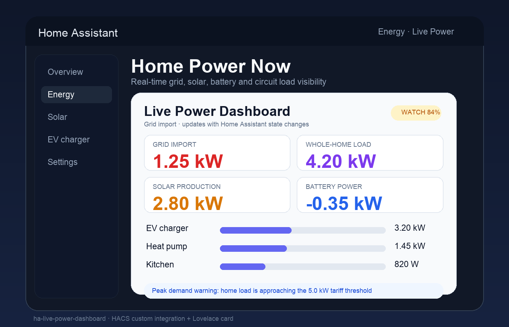

# Live Power Dashboard for Home Assistant

A HACS-ready custom integration and Lovelace card for real-time power visibility. It fills the gap between Home Assistant's historical Energy dashboard and the live operational view people need for EMS decisions.



## What it shows

- Whole-home live load in W/kW.
- Grid import/export direction.
- Solar production and battery power.
- Per-breaker, socket, appliance or EV charging circuits.
- Peak-demand threshold status for demand tariffs.

## Installation

### HACS custom repository

1. HACS → Integrations → three-dot menu → Custom repositories.
2. Add `https://github.com/rusty4444/ha-live-power-dashboard` as an **Integration**.
3. Install **Live Power Dashboard**.
4. Restart Home Assistant.
5. Settings → Devices & services → Add Integration → **Live Power Dashboard**.
6. Add this dashboard resource if HACS has not added it automatically:
   `/live_power_dashboard_static/power-dashboard-card.js` as a JavaScript module.

### Manual

Copy `custom_components/live_power_dashboard` into your Home Assistant `custom_components` directory, restart, then add the integration from the UI.

## Lovelace card example

```yaml
type: custom:live-power-dashboard-card
title: Home Power Now
grid_power: sensor.grid_power
solar_power: sensor.solar_power
battery_power: sensor.battery_power
load_power: sensor.home_load_power
peak_threshold_w: 5000
circuits:
  - name: EV charger
    entity: sensor.ev_charger_power
    max_power: 7400
  - name: Heat pump
    entity: sensor.heat_pump_power
    max_power: 3600
  - name: Kitchen
    entity: sensor.kitchen_circuit_power
    max_power: 3000
```

Positive grid power is treated as import. Negative grid power is treated as export. Power sensors with `W`, `kW`, or `MW` units are converted to watts before display.

## Storage API

The integration also exposes an authenticated local REST endpoint for UI builders and future automation packs:

- `GET /api/live_power_dashboard/config` returns stored dashboard presets.
- `POST /api/live_power_dashboard/config` validates and saves one preset.
- `DELETE /api/live_power_dashboard/config?id=<preset-id>` removes a preset.

Example preset payload:

```json
{
  "id": "home",
  "title": "Home Power",
  "entities": {
    "grid_power": "sensor.grid_power",
    "solar_power": "sensor.solar_power",
    "battery_power": "sensor.battery_power",
    "load_power": "sensor.home_load_power"
  },
  "circuits": [{"name": "EV", "entity": "sensor.ev_power", "max_power": 7400}],
  "tariff": {"threshold_w": 5000, "currency": "AUD"}
}
```

## Security model

- No cloud dependency.
- No external network calls.
- REST endpoints require Home Assistant authentication.
- Entity IDs and numeric values are validated before storage.
- The card escapes user-controlled Lovelace config strings before rendering.

## Development

```bash
npm install
npm run check
```

`npm run check` bundles the frontend, runs Node tests, runs Python tests, and py-compiles the custom component.

## Status

MVP / early release. Planned next steps:

- visual editor for selecting energy entities;
- stored preset picker card;
- demand-tariff prediction using rolling windows;
- optional automation blueprints for EV/battery/load shedding.
